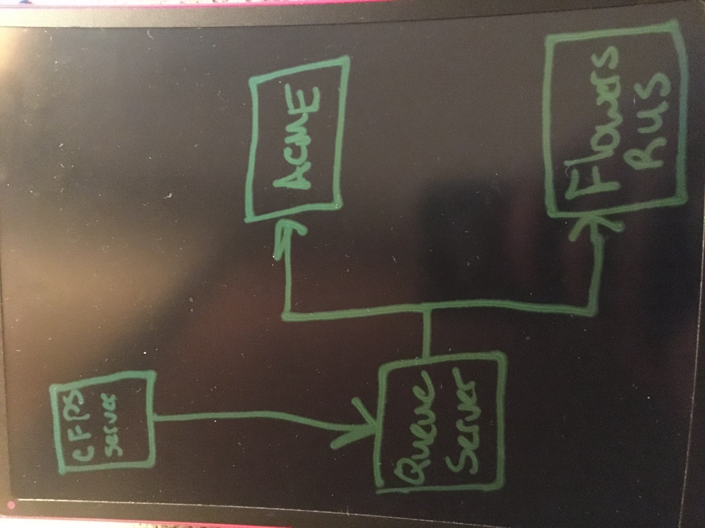

# LAB - 19

## Message Queues

### Author: Lindsay Peltier

### Links and Resources

* [submission PR](https://github.com/LindsayPeltier-401-advanced-javascript/Apprenti-401-Lab-19/pull/1)
* [travis](https://www.travis-ci.com/LindsayPeltier-401-advanced-javascript/Apprenti-401-Lab-19)

#### Documentation

* [JSDocs](./docs/index.html)

### Setup

* `PORT` - 3001

#### How to initialize/run your server app (where applicable)

* `npm start`
* Endpoint: /docs
  * Returns JSdocs
  
#### Tests

* Unit Tests: `npm test`
* Lint Tests: `npm run lint`

#### UML

